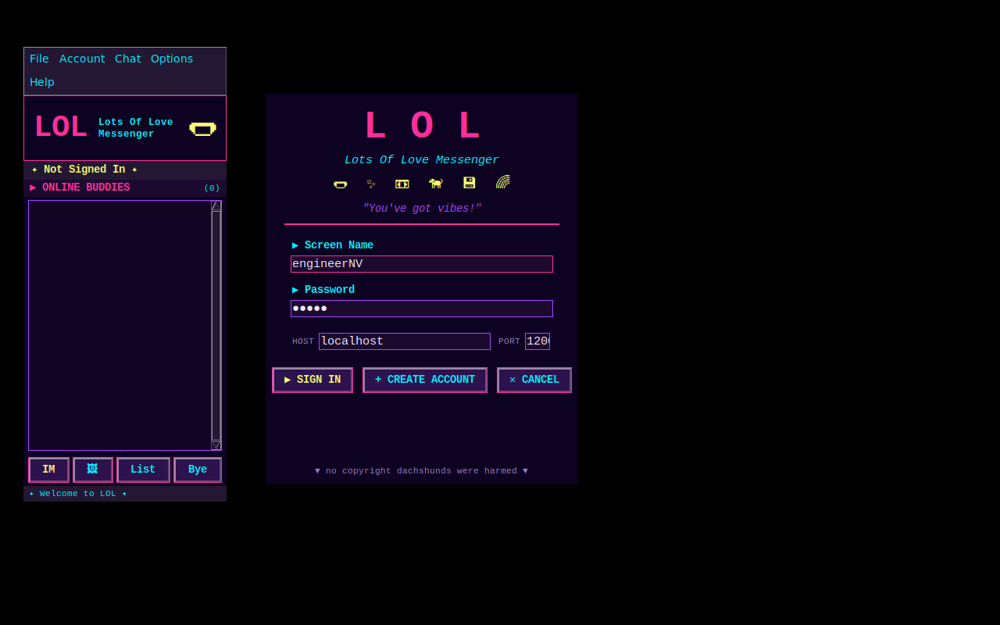
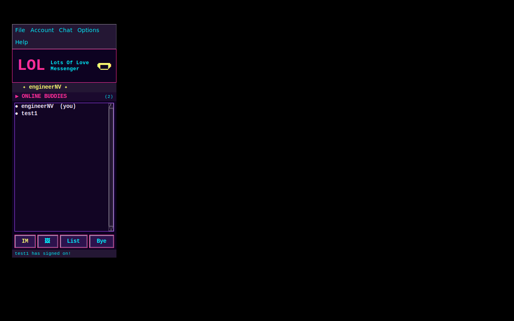
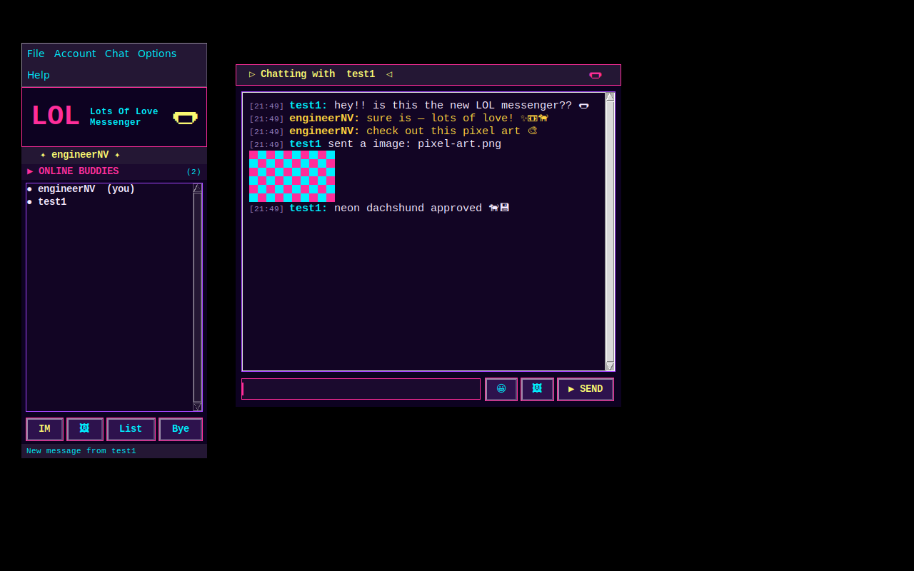
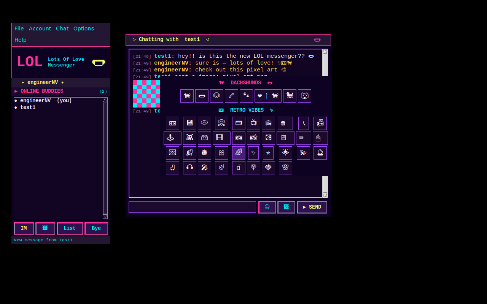

# LOL Messenger 🌭

> "Lots Of Love" — a retro/synthwave TCP chatroom in Python with a tkinter GUI,
> sound effects, dachshund + retro emoji picker, image/GIF sharing, and a
> SQLite-backed account system with self-service registration.

> Originally created 2017 as an AOL-style chatroom. Rebranded and upgraded to
> dodge any imaginary copyright dachshunds.

---

## Screenshots

| Sign in | Buddy list |
|---------|------------|
|  |  |

| Conversation with inline media | Emoji picker |
|--------------------------------|--------------|
|  |  |

*(Captured headlessly under Xvfb — emoji render in color on desktops with an
emoji font installed.)*

---

## Requirements

- Python 3.10+ (uses `X | Y` type hints)
- `tkinter` — ships with most Python installs
  ```bash
  # Ubuntu/Debian only
  sudo apt install python3-tk
  ```
- An audio player on `PATH` for sound effects (optional):
  - Linux: `paplay`, `aplay`, `play` (sox), or `ffplay`
  - macOS: `afplay` (built in)
  - Windows: `winsound` (built in)

No third-party pip packages are required.

---

## Running

```bash
# Terminal 1 — start the server (creates chat-data.db on first run)
python3 chat-server.py

# Terminal 2+ — launch the GUI client
python3 chat-client-gui.py

# Optional: CLI client for quick testing
python3 chat-client.py
```

---

## Accounts

The server stores accounts in a local **SQLite** database (`chat-data.db`)
with PBKDF2-SHA256 password hashes. On first run the file is created and
seeded with these test accounts:

| Username   | Password |
|------------|----------|
| test1      | p000     |
| test2      | p000     |
| test3      | p000     |
| engineerNV | p591     |

After that, **users register themselves from the client** — there's a
`+ CREATE ACCOUNT` button on the sign-in dialog and an `Account → Create
new account…` menu item. The server validates uniqueness and basic length
rules before storing the new credentials.

---

## Features

- 🎀 **Synthwave/vaporwave UI** — neon pink, cyan, and purple over deep navy.
- 🔊 **Sound effects** — generated at startup as small WAVs and played via
  the platform's audio tool. Toggle via `Options → Toggle sound`. Sounds:
  message-in, message-send, sign-in, sign-off, error buzz, and a sparkly
  arrival ping for incoming media.
- 🐕 **Dachshund + retro emoji picker** — `😀` button on each chat window.
- 🖼 **Image & GIF sharing** — `🖼` button picks a file (PNG / GIF, ≤4 MB),
  base64-encodes it, and the recipient sees it inline. Animated GIFs play
  by cycling frames in the `Text` widget.
- 🗄 **SQLite account store** with PBKDF2-SHA256 hashing and a
  `message_log` table that records sender / recipient / kind / timestamp
  for every routed message.
- 🪟 **Menu bar** — File, Account, Chat, Options, Help.

---

## Configuration

| Setting | Location |
|---------|----------|
| Server host / port | `SERVER_HOST` / `SERVER_PORT` in `chat-server.py` |
| Client default host / port | `SERVER_HOST` / `SERVER_PORT` in `chat-client-gui.py` (also editable in the login dialog) |
| Theme colours & fonts | `NEON_*`, `DEEP_*`, `FONT_*` constants near the top of `chat-client-gui.py` |
| Emoji palette | `DACHSHUND_EMOJIS` / `RETRO_EMOJIS` in `chat-client-gui.py` |
| Max media size | `MAX_MEDIA_BYTES` in `chat-client-gui.py` (default 4 MB) |

---

## Protocol

All messages are newline-terminated and colon-delimited UTF-8 text. Media
payloads are base64 inline so the wire format stays line-based; the server
buffers up to 8 MB per line.

| Direction | Message | Meaning |
|-----------|---------|---------|
| C → S | `HELLO` | Initiate handshake |
| S → C | `HELLO` | Handshake ack |
| C → S | `REGISTER:username:password` | Create new account |
| S → C | `REGYES` / `REGNO:reason` | Registration result |
| C → S | `AUTH:username:password` | Login attempt |
| S → C | `AUTHYES` / `AUTHNO:reason` | Login result |
| C → S | `LIST` | Request online users |
| S → C | `user1, user2, ...` | Online users list |
| C → S | `TO:recipient:message` | Send text DM |
| S → C | `FROM:sender:message` | Receive text DM |
| C → S | `TOMEDIA:recipient:kind:filename:base64data` | Send image / GIF |
| S → C | `FROMMEDIA:sender:kind:filename:base64data` | Receive image / GIF |
| S → C | `SIGNIN:username` | Broadcast: user came online |
| S → C | `SIGNOFF:username` | Broadcast: user went offline |
| S → C | `SYSMSG:text` | System notice |
| C → S | `BYE` | Sign off |

`kind` is `image` (PNG) or `gif`.

---

## Testing

Both suites are stdlib-only. The backend suite boots the real server on an
ephemeral port against a throwaway database and drives it over TCP:

```bash
python3 tests/test_backend.py
```

The GUI suite drives a real `BuddyList` window end to end (sign-in, message
routing, inline media, sound generation). It needs tkinter and an X display —
on a headless box, use Xvfb:

```bash
xvfb-run -a python3 tests/test_gui_smoke.py
```

To regenerate the README screenshots (needs `xwd` from x11-apps and
ImageMagick):

```bash
xvfb-run -a -s "-screen 0 1280x800x24" python3 tests/capture_screenshots.py
```

---

## Files

| File | Description |
|------|-------------|
| `chat-server.py` | Multi-threaded TCP server with SQLite accounts, registration, message logging, and base64 media routing |
| `chat-client-gui.py` | Tkinter GUI client (synthwave theme, sound FX, emoji picker, media sharing, menu bar) |
| `chat-client.py` | Minimal CLI client — sign-in, registration, listing, text DMs; handy for testing without tkinter |
| `tests/test_backend.py` | End-to-end server tests over real sockets |
| `tests/test_gui_smoke.py` | Headless GUI smoke tests (Xvfb-friendly) |
| `tests/capture_screenshots.py` | Regenerates the README screenshots |
| `chat-data.db` | SQLite database (gitignored, generated on first server run) |
| `CLAUDE.md` | Developer reference: architecture, protocol, and common tasks |
